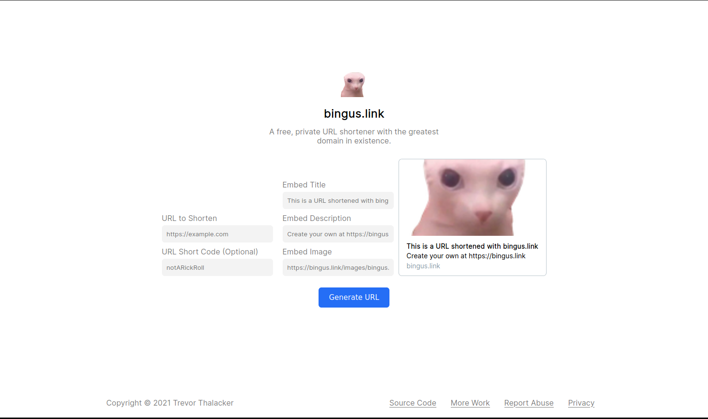

<h1 align="center"><a href="https://bingus.link">bingus.link</a></h1>

A free, private URL shortener

---

# Running your own bingus.link

While I don't recommend running a custom version of bingus.link, it's not hard to do.

1. Create a MongoDB database
1. Copy `.env.example` to `.env`, and replace all the values inside it
1. Modify all files inside `static` and `templates`, these are the frontend files. You probably would need to mostly edit `static/css/main.css` and most files inside `templates/includes`, as these are the stylesheets and common UI files.
1. Run `docker-compose up -d`

# License

This project is licensed under the [GNU AGPL v3.0 License](LICENSE)
